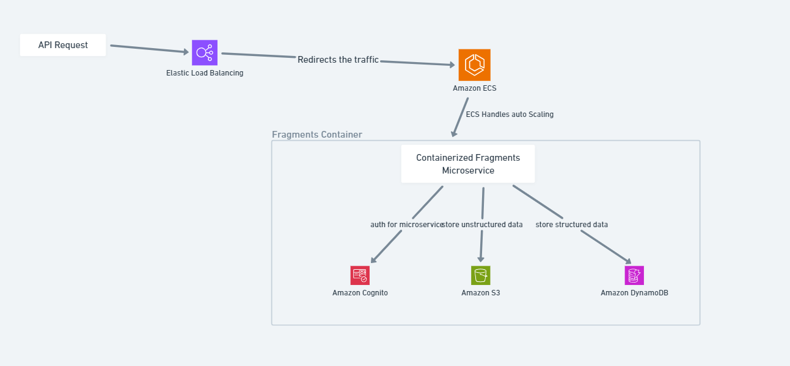
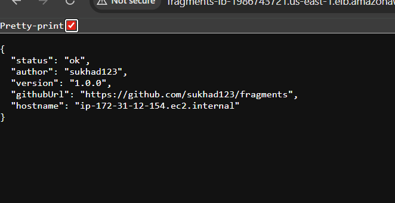
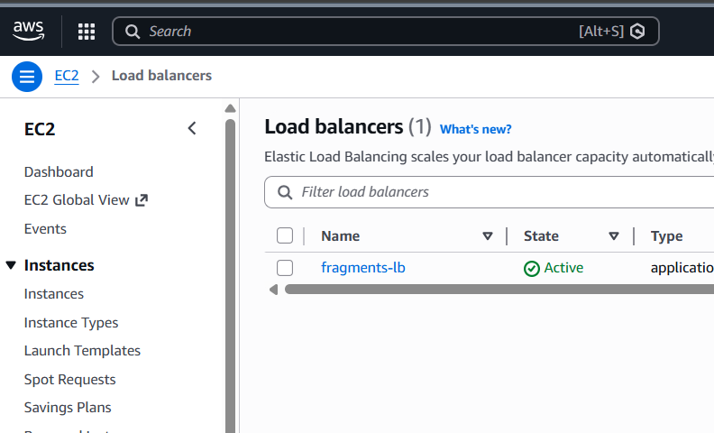
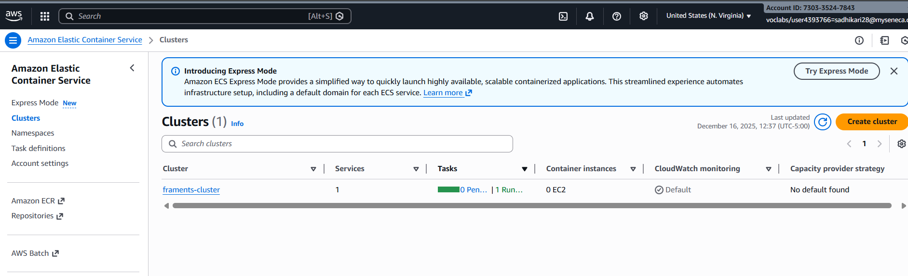
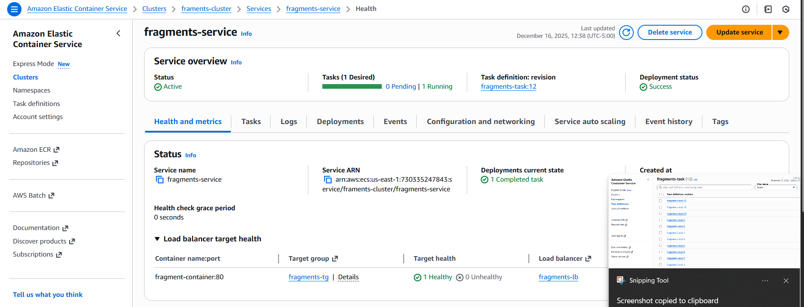
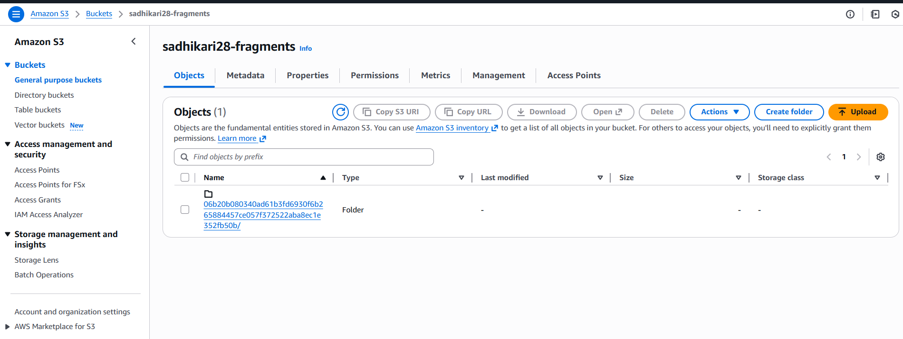
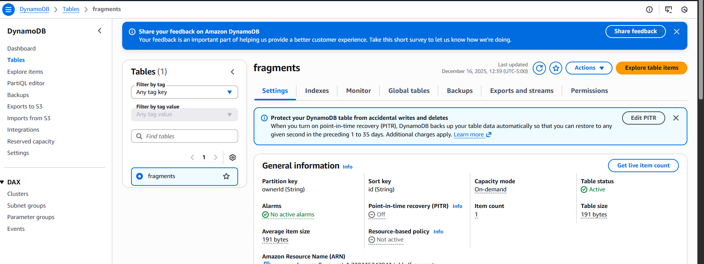

# Fragment Management API 🧩

This project provides a robust and scalable API for managing data fragments. It allows users to create, read, update, and delete fragments, with support for various content types and authentication methods. The API is designed to be flexible and can be deployed to different environments, including AWS and local development setups. It solves the problem of efficiently managing and serving data fragments in a secure and reliable manner.

## 🚀 Key Features

- **Fragment Management:** Create, read, update, and delete data fragments with ease.
- **Content Type Support:** Handles various content types, ensuring data integrity and proper handling.
- **Authentication:** Supports both Cognito JWT and HTTP Basic Authentication for secure access.
- **Scalability:** Designed to scale using AWS services such as S3 and DynamoDB.
- **Environment Flexibility:** Easily configurable for different environments, including local development with in-memory storage.
- **Standardized Responses:** Uses consistent success and error response formats for easy client integration.
- **Logging:** Comprehensive logging using Pino for debugging and monitoring.
- **Graceful Shutdown:** Implements graceful server shutdown to prevent data loss.

## 🛠️ Tech Stack

- **Backend:**
  - Node.js
  - Express.js: Web application framework
- **Database:**
  - AWS DynamoDB (production)
  - In-memory database (development/testing)
- **Storage:**
  - AWS S3 (production)
- **Authentication:**
  - Passport.js: Authentication middleware
  - AWS Cognito JWT
  - HTTP Basic Authentication
  - `http-auth`, `http-auth-passport`
- **AWS SDK:**
  - `@aws-sdk/client-dynamodb`
  - `@aws-sdk/lib-dynamodb`
  - `@aws-sdk/client-s3`
- **Utilities:**
  - `crypto`: Node.js built-in crypto module for hashing
  - `content-type`: Library for working with Content-Type headers
  - `dotenv`: Loads environment variables from `.env` file
  - `stoppable`: Allows for graceful server shutdown
  - `pino`: Logging library
  - `pino-http`: Pino HTTP request logger
  - `cors`: Middleware for enabling Cross-Origin Resource Sharing
  - `helmet`: Middleware for securing HTTP headers
  - `compression`: Middleware for compressing HTTP responses
  - `aws-jwt-verify`: For verifying Cognito JWTs.
- **Build Tools:**
  - N/A (Node.js project, no explicit build tools mentioned)

## 📦 Getting Started

### Prerequisites

- Node.js (>=14)
- npm or yarn
- AWS account (if deploying to AWS)
- AWS CLI configured with appropriate credentials (if deploying to AWS)
- Environment variables configured (see `.env.example` for required variables)

### Installation

1.  Clone the repository:

    ```bash
    git clone https://github.com/sukhad123/fragments.git
    cd fragments
    ```

2.  Install dependencies:

    ```bash
    npm install # or yarn install
    ```

3.  Configure environment variables:
    - Create a `.env` file in the root directory.
    - Copy the contents of `.env.example` into the `.env` file.
    - Update the values in `.env` with your specific configuration. Pay close attention to `AWS_REGION`, `AWS_COGNITO_POOL_ID`, `AWS_COGNITO_CLIENT_ID`, and `HTPASSWD_FILE`. If using Basic Auth, ensure `NODE_ENV` is _not_ set to `production`.

### Running Locally

1.  Start the server:

    ```bash
    npm start # or yarn start
    ```

2.  The server will start on port 8080 (or the port specified in the `PORT` environment variable).

## 💻 Project Structure

```
📂 project-root
├── src
│   ├── app.js             # Express application setup
│   ├── server.js          # Server startup and shutdown
│   ├── index.js           # Main entry point
│   ├── hash.js            # Email hashing utility
│   ├── logger.js          # Pino logger configuration
│   ├── response.js        # Standardized response utilities
│   ├── auth
│   │   ├── auth-middleware.js # Authentication middleware
│   │   ├── basic-auth.js    # HTTP Basic Authentication strategy
│   │   ├── cognito.js       # Cognito JWT Authentication strategy
│   │   └── index.js         # Authentication module selector
│   ├── model
│   │   ├── fragments.js     # Fragment data model and operations
│   │   ├── data
│   │   │   ├── index.js       # Data access module selector
│   │   │   ├── aws
│   │   │   │   ├── ddbDocClient.js # DynamoDB Document Client
│   │   │   │   └── s3Client.js    # S3 Client
│   │   │   └── memory
│   │   │       └── memory-db.js   # In-memory database
├── .env.example       # Example environment variables
├── package.json       # Project dependencies and scripts
├── README.md          # Project documentation
```

## 📸 Screenshots

High Level System Architecture diagram

App Deployed Link

Load Balancer

Elastic Container Service
Cluster

Task Definition

Service

AWS S3

Dynamo DB


## 🤝 Contributing

We welcome contributions to this project! Please follow these steps:

1.  Fork the repository.
2.  Create a new branch for your feature or bug fix.
3.  Make your changes and commit them with clear, concise messages.
4.  Submit a pull request.

## 📝 License

This project is licensed under the [MIT License](LICENSE).

## 📬 Contact

Sukhad Adhikari

## 💖 Thanks Message

Thank you for checking out this project! We hope it's helpful and look forward to your contributions.
